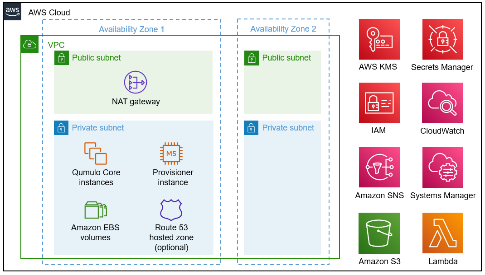

# aws-quickstart-cloud-q
AWS CloudFormation templates hosted by AWS in regional Quick Start buckets to deploy a Qumulo cluster with one to 20 instances per the AWS Well Architected Framework.
Supports usable capacities from 1TB to 6PB with all Qumulo Core features.

## Requirements

These templates deploy Qumulo AMIs with [Qumulo Core Cloud Software](https://qumulo.com/product/cloud-products/) version `>= 4.2.0`

A subscription to an [AWS Marketplace](https://aws.amazon.com/marketplace/search/results?x=0&y=0&searchTerms=qumulo) offer is required.
For private offers via the AWS Marketplace contact [Qumulo Sales](http://discover.qumulo.com/cloud-calc-contact.html).

## Usage
The deployment guide and CloudFormation code are hosted by AWS.  Follow the link:
[Qumulo Cloud Q Quick Start](https://fwd.aws/EXedJ?)

Reference Architecture:

## Help

Please post all feedback via the AWS GitHub repository feedback link.

__Note:__ This project is provided as a public service to the AWS/CloudFormation
community and is not directly supported by Qumulo's paid enterprise support. It is
intended to be used by expert users only.

## Copyright

Copyright © 2021 [Qumulo, Inc.](https://qumulo.com)

## License

See [LICENSE](LICENSE) for full details

    MIT License
    
    Copyright (c) 2021 Qumulo, Inc.
    
    Permission is hereby granted, free of charge, to any person obtaining a copy
    of this software and associated documentation files (the "Software"), to deal
    in the Software without restriction, including without limitation the rights
    to use, copy, modify, merge, publish, distribute, sublicense, and/or sell
    copies of the Software, and to permit persons to whom the Software is
    furnished to do so, subject to the following conditions:
    
    The above copyright notice and this permission notice shall be included in all
    copies or substantial portions of the Software.
    
    THE SOFTWARE IS PROVIDED "AS IS", WITHOUT WARRANTY OF ANY KIND, EXPRESS OR
    IMPLIED, INCLUDING BUT NOT LIMITED TO THE WARRANTIES OF MERCHANTABILITY,
    FITNESS FOR A PARTICULAR PURPOSE AND NONINFRINGEMENT. IN NO EVENT SHALL THE
    AUTHORS OR COPYRIGHT HOLDERS BE LIABLE FOR ANY CLAIM, DAMAGES OR OTHER
    LIABILITY, WHETHER IN AN ACTION OF CONTRACT, TORT OR OTHERWISE, ARISING FROM,
    OUT OF OR IN CONNECTION WITH THE SOFTWARE OR THE USE OR OTHER DEALINGS IN THE
    SOFTWARE.

## Trademarks

All other trademarks referenced herein are the property of their respective owners.

### Contributors

 - [Dack Busch](https://github.com/dackbusch)
 - [Gokul Kupparaj](https://github.com/dackbusch)
